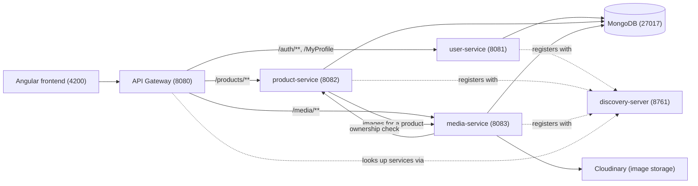

# buy-01

An end-to-end e-commerce platform built as **Spring Boot microservices** behind an API gateway, with an **Angular** frontend. Users register as **clients** or **sellers** — sellers manage products and their photos, clients browse and view them.

[](https://github.com/ayoubnachti/buy-01/actions/workflows/api-gateway-ci.yml)
[](https://github.com/ayoubnachti/buy-01/actions/workflows/discovery-server-ci.yml)
[](https://github.com/ayoubnachti/buy-01/actions/workflows/user-service-ci.yml)
[](https://github.com/ayoubnachti/buy-01/actions/workflows/product-service-ci.yml)
[](https://github.com/ayoubnachti/buy-01/actions/workflows/media-service-ci.yml)
[](https://github.com/ayoubnachti/buy-01/actions/workflows/frontend-ci.yml)

## Table of contents

- [buy-01](#buy-01)
  - [Table of contents](#table-of-contents)
  - [Architecture](#architecture)
  - [Tech stack](#tech-stack)
  - [Project structure](#project-structure)
  - [Services](#services)
    - [user-service](#user-service)
    - [product-service](#product-service)
    - [media-service](#media-service)
    - [api-gateway](#api-gateway)
  - [Authentication](#authentication)
  - [Getting started](#getting-started)
  - [HTTPS (self-signed, local dev)](#https-self-signed-local-dev)
  - [Environment variables](#environment-variables)
  - [Demo data](#demo-data)
  - [Testing](#testing)

## Architecture

Every request from the browser goes through a single entry point, the **API Gateway**, which validates the JWT and forwards the request to the right backend service. Services find each other through the **Eureka** discovery server rather than hardcoded hosts/ports, and each service owns its own MongoDB database.



Each service uses its own database inside the same MongoDB instance: `users_db`, `products_db`, `media_db`.

## Tech stack

**Backend**
- Java 17, Spring Boot 4
- Spring Cloud Gateway (MVC) — routing, JWT validation
- Spring Cloud Netflix Eureka — service discovery
- Spring Data MongoDB
- Spring Security
- Resilience4j — circuit breaker for the product → media call
- Cloudinary SDK — image storage for media-service

**Frontend**
- Angular 21 (standalone components, signals, zoneless change detection)
- Bootstrap 5
- Vitest — unit tests

**Infra / tooling**
- Docker Compose — local orchestration
- MongoDB 7
- k6 — load testing (`load-tests/`)
- GitHub Actions — CI per service

## Project structure

```
buy-01/
├── compose.yml                 # orchestrates every service locally
├── discovery-server/           # Eureka registry
│   └── src/main/java/com/ecommerce/discoveryserver/
├── api-gateway/                # single entry point, JWT auth, routing
│   └── src/main/java/com/ecommerce/apigateway/
│       ├── config/             # routes, CORS, gateway filters
│       └── security/           # JWT validation filter
├── user-service/               # accounts, auth, profile
│   └── src/main/java/com/ecommerce/userservice/
│       ├── controller/         # AuthController, ProfileController
│       ├── service/            # AuthService, JwtService, ProfileService
│       ├── model/ · repository/
│       └── config/             # DataSeeder, SecurityConfig
├── product-service/             # product catalog
│   └── src/main/java/com/ecommerce/productservice/
│       ├── controllers/        # ProductController
│       ├── services/           # ProductService
│       ├── clients/            # Feign/REST client to media-service
│       ├── models/ · repositories/
│       └── security/           # trusts gateway-forwarded user headers
├── media-service/              # product/profile image storage
│   └── src/main/java/com/ecommerce/mediaservice/
│       ├── controllers/        # MediaController
│       ├── services/           # MediaService (validation, Cloudinary calls)
│       ├── clients/            # client back to product-service (ownership check)
│       ├── models/ · repositories/
│       └── security/
├── frontend/                   # Angular app
│   └── src/app/
│       ├── core/                # guards, interceptors, app-wide services
│       ├── features/
│       │   ├── auth/            # login, register
│       │   ├── products/        # list, detail, form, table row
│       │   ├── media/           # <app-upload> picker (components/services/models/utils)
│       │   ├── profile/         # account settings + avatar
│       │   └── seller-dashboard/
│       └── shared/               # reusable components (carousel, modal, toasts, ...)
├── load-tests/                  # k6 scripts
└── .github/workflows/           # one CI pipeline per service
```

## Services

| Service | Port | Responsibility |
|---|---|---|
| `discovery-server` | 8761 | Eureka registry all other services register with |
| `api-gateway` | 8080 | Single public entry point; validates JWTs and routes to the right service |
| `user-service` | 8081 | Registration, login, profile |
| `product-service` | 8082 | Product CRUD, ownership checks, pagination |
| `media-service` | 8083 | Image upload/delete/lookup, Cloudinary storage |
| `frontend` | 4200 | Angular SPA |
| `mongodb` | 27017 | One shared instance, one database per service |

### user-service
- `POST /auth/register`, `POST /auth/login`
- `GET /MyProfile`, `PUT /MyProfile`
- Issues the JWT on login; passwords hashed with Spring Security's `PasswordEncoder`.

### product-service
- `GET /products`, `GET /products/{id}`, `POST /products`, `PUT /products/{id}`, `DELETE /products/{id}`
- Fetches each product's image URLs from media-service on read, through a Resilience4j circuit breaker (falls back to an empty image list if media-service is unavailable).

### media-service
- `POST /media/images`, `PUT /media/images`, `DELETE /media/images`, `GET /media/images`, `GET /media/images/{productId}`
- Validates uploads (image type, size, max count per target), stores/removes the file on Cloudinary, and keeps a `Media` record per uploaded image in MongoDB.
- Confirms the caller actually owns the product before allowing a change, by calling back into product-service.

### api-gateway
- Routes `/auth/**` and `/MyProfile` → user-service, `/products/**` → product-service, `/media/**` → media-service.
- Validates the `Authorization` bearer JWT and forwards the authenticated user's id/role downstream as `X-User-Id` / `X-User-Role` headers, so individual services never re-verify the JWT themselves.

## Authentication

1. The client logs in through `user-service`, which returns a signed JWT.
2. The frontend attaches that JWT as a `Bearer` token on every request (see `core/interceptors/auth.interceptor.ts`).
3. `api-gateway` validates the token and, on success, injects `X-User-Id` and `X-User-Role` headers before forwarding the request.
4. `product-service` and `media-service` never see the JWT — they trust those two headers (set only by the gateway) to populate the security context for that request.

## Getting started

**Prerequisites:** Docker and Docker Compose.

```bash
git clone https://github.com/ayoubnachti/buy-01.git
cd buy-01
docker compose up --build
```

This starts, in order: `mongodb` → `discovery-server` → `user-service` / `product-service` / `media-service` → `api-gateway` → `frontend`.

Once healthy:
- Frontend: http://localhost:4200
- API Gateway: http://localhost:8080
- Eureka dashboard: http://localhost:8761

To run a single backend service outside Docker (e.g. for debugging), each one is a standalone Maven project:

```bash
cd product-service
./mvnw spring-boot:run
```

## HTTPS (self-signed, local dev)

`api-gateway` serves over HTTPS on port `8443` using a self-signed certificate —
this is the only service with TLS; every other service stays on plain HTTP
behind it, since nothing outside the Docker network can reach them directly
(only `gateway:8443` and `discovery:8761` are exposed to the host).

### Generating the keystore (already done once — regenerate if needed)

```bash
keytool -genkeypair \
  -alias gateway \
  -keyalg RSA \
  -keysize 2048 \
  -storetype PKCS12 \
  -keystore keystore.p12 \
  -validity 3650 \
  -dname "CN=localhost, OU=Dev, O=Vendify" \
  -storepass changeit \
  -keypass changeit
```

Notes on the flags:
- `-storepass` / `-keypass` must be **identical** for a PKCS12 keystore —
  the format doesn't support a separate per-entry key password the way
  older JKS keystores did. `keytool` will warn (or reject) if they differ.
- `-dname "CN=localhost, ..."` sets all the identity fields non-interactively
  in one go — omit it and `keytool` prompts for each field one at a time,
  plus a yes/no confirmation, which is fine by hand but not reproducible
  in a script or a teammate following these instructions blind.
- If you're on **Windows using Git Bash**, this command has an advantage
  worth knowing about: `openssl`'s equivalent needs a `-subj` value starting
  with `/` (e.g. `/CN=localhost`), which Git Bash's automatic Unix-path
  conversion mangles before `openssl` ever sees it. `keytool`'s `-dname`
  value has no leading `/`, so it isn't affected by that conversion at all.

Update `SSL_KEYSTORE_PASSWORD` in `.env` to match `-storepass` if you
change it from `changeit`, and `SSL_KEYSTORE_PATH` if you move the file
somewhere other than the default `classpath:keystore.p12`.

Place `keystore.p12` at `api-gateway/src/main/resources/keystore.p12` —
Maven packages it into the built JAR from there, no separate volume
mount needed for the default classpath-based setup.

## Environment variables

| Variable | Used by | Default | Notes |
|---|---|---|---|
| `MONGODB_URI` | user/product/media-service | `mongodb://localhost:27017/<service>_db` | Set per-service in `compose.yml` |
| `EUREKA_CLIENT_SERVICEURL_DEFAULTZONE` | all services | `http://localhost:8761/eureka/` | Points every service at the discovery server |
| `JWT_SECRET` | user-service, api-gateway | a dev default in `application.*` | Must match between the two — override in production |
| `SSL_KEYSTORE_PATH` | api-gateway | `classpath:keystore.p12` | See [HTTPS](#https-self-signed-local-dev) |
| `SSL_KEYSTORE_PASSWORD` | api-gateway | `changeit` | Must match the `-storepass` used to generate `keystore.p12` |
| `CLOUDINARY_URL` | media-service | *(required, no default)* | Set in `media-service/.env` (not committed); get it from your Cloudinary dashboard |
| `CORS_ALLOWED_ORIGIN` | api-gateway | `http://localhost:4200` | Frontend origin allowed through CORS |

## Demo data

On first boot with an empty database, each service seeds a bit of sample data:
- `user-service`: two demo client accounts (`ayoub@gmail.com` / `Bob@gmail.com`, password `12345678`).
- `product-service`: four demo products.

Register a new account with the **seller** role from the frontend to try the seller dashboard (product create/edit/delete, image upload).

## Testing

- Backend: each service has its own JUnit test suite — `./mvnw test` from inside that service's folder.
- Frontend: `cd frontend && npm test` (Vitest).
- Load testing: `./load-tests/run-load-test.sh` runs the k6 script in `load-tests/seller-load-test.js` against the local stack (requires Docker; needs the stack already running).
- CI: every push/PR runs the matching workflow in `.github/workflows/` for whichever service changed.
