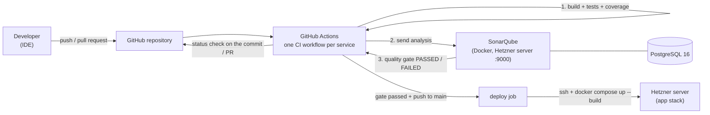

# Code quality with SonarQube — safe-zone

This document explains the goal of the **safe-zone** project and how we reached it:
how SonarQube was set up, how it is connected to GitHub and the CI/CD pipeline,
and how it is used to keep the code of the **buy-01** e-commerce platform clean and secure.

For the application itself (architecture, services, how to run it), see [README.md](README.md).

## Table of contents

- [The subject](#the-subject)
- [Overall picture](#overall-picture)
- [1. Running SonarQube with Docker](#1-running-sonarqube-with-docker)
- [2. Configuring SonarQube for the project](#2-configuring-sonarqube-for-the-project)
- [3. GitHub integration and the CI pipeline](#3-github-integration-and-the-ci-pipeline)
- [4. Test coverage](#4-test-coverage)
- [5. Quality gate: failing the pipeline](#5-quality-gate-failing-the-pipeline)
- [6. Continuous deployment](#6-continuous-deployment)
- [7. Code review and approval process](#7-code-review-and-approval-process)
- [8. Security and permissions](#8-security-and-permissions)
- [9. How SonarQube improves code quality](#9-how-sonarqube-improves-code-quality)
- [10. Bonus: notifications and IDE integration](#10-bonus-notifications-and-ide-integration)
- [Repository files involved](#repository-files-involved)

## The subject

The goal is to add **automated code quality and security analysis** to an existing
microservices project, using **SonarQube**:

- run SonarQube in **Docker**, and access its web interface;
- connect it to the **GitHub repository** so every push is analysed;
- integrate the analysis into the **CI/CD pipeline**, and make the pipeline
  **fail** when code quality or security does not meet the standard;
- put a **code review and approval process** in place;
- set **permissions** so analysis results are not public;
- use SonarQube's findings to **actually improve the code**, and commit those fixes;
- bonus: **notifications** (email/Slack) and **IDE integration** (SonarLint / SonarQube for IDE).

## Overall picture



## 1. Running SonarQube with Docker

SonarQube has its own Compose file, [docker-compose.sonarqube.yml](docker-compose.sonarqube.yml),
separate from the application stack ([compose.yml](compose.yml)). This keeps the two
independent: redeploying the shop never restarts SonarQube, and the other way round.

| Container | Image | Role |
|---|---|---|
| `sonarqube` | `sonarqube:lts-community` | The SonarQube server and web UI, on port **9000** |
| `sonarqube-db` | `postgres:16` | SonarQube's database (the embedded H2 database is only for testing) |

Details:

- **Separate Compose project** (`name: sonarqube`) and **separate network** (`sonarqube-network`),
  so `docker compose` commands on the app stack never treat SonarQube as an "orphan" container.
- **Named volumes** (`safe-zone_sonarqube_*`) hold the database, SonarQube data, logs
  and plugins, so analysis history survives restarts and container recreation.
- **Credentials come from `.env`** (`SONAR_DB_USER`, `SONAR_DB_PASSWORD`, `SONAR_DB_NAME`,
  `SONAR_JDBC_URL`) and are never committed. See [.env.example](.env.example).

Start it on the server:

```bash
docker compose -f docker-compose.sonarqube.yml up -d
docker compose -f docker-compose.sonarqube.yml logs -f sonarqube   # wait for "SonarQube is operational"
```

Then open `http://<server-ip>:9000`.

> SonarQube runs Elasticsearch inside, which needs `vm.max_map_count >= 524288` on the host:
> `sysctl -w vm.max_map_count=524288` (add it to `/etc/sysctl.conf` to make it permanent).

## 2. Configuring SonarQube for the project

Done once in the web UI:

1. Log in with `admin` / `admin` and **change the admin password** (SonarQube requires it).
2. Create **one SonarQube project per service**, with these project keys:
   `api-gateway`, `discovery-server`, `user-service`, `product-service`, `media-service`, `frontend`.
   Each service is its own Maven/npm project, so each gets its own dashboard,
   issues and quality gate.
3. Keep the built-in **"Sonar way"** quality profiles (Java, TypeScript, HTML, CSS)
   and the **"Sonar way"** quality gate. The gate checks **new code**: no new bugs,
   vulnerabilities or unreviewed security hotspots, coverage ≥ 80%, duplication ≤ 3%.
4. Generate an **analysis token** (*My Account → Security*), used by GitHub Actions.

## 3. GitHub integration and the CI pipeline

Two **GitHub repository secrets** connect GitHub to SonarQube:

| Secret | Value |
|---|---|
| `SONAR_HOST_URL` | `http://<server-ip>:9000` |
| `SONAR_TOKEN` | The analysis token generated in SonarQube |

Each service has its own workflow in [.github/workflows/](.github/workflows/):

| Workflow | Triggers on changes in | Analysis |
|---|---|---|
| `api-gateway-ci.yml` | `api-gateway/**` | Maven `sonar:sonar` |
| `discovery-server-ci.yml` | `discovery-server/**` | Maven `sonar:sonar` |
| `user-service-ci.yml` | `user-service/**` | Maven `sonar:sonar` (with a MongoDB service container for tests) |
| `product-service-ci.yml` | `product-service/**` | Maven `sonar:sonar` (with MongoDB) |
| `media-service-ci.yml` | `media-service/**` | Maven `sonar:sonar` (with MongoDB) |
| `frontend-ci.yml` | `frontend/**` | `SonarSource/sonarqube-scan-action` |

Every workflow runs on **`push`** (any branch) and on **`pull_request`**, with path
filters so only the services that changed are built and analysed. Each run:

1. checks out the code with `fetch-depth: 0` (full Git history, so SonarQube can
   tell **new code** from old code and attribute issues with blame);
2. sets up JDK 17 (or Node 20 for the frontend);
3. builds and runs the tests (`mvn -B verify`, or `npm ci`, `ng test`, `npm run build`);
4. sends the analysis to SonarQube, then **waits for the quality gate result**.

The api-gateway workflow first creates a throwaway self-signed `keystore.p12`, because
the real keystore is not committed and the gateway's tests need one to start.

## 4. Test coverage

Without coverage reports, SonarQube shows 0% and the "coverage on new code" condition always fails.

- **Spring Boot services:** the JaCoCo Maven plugin is in each `pom.xml`. `mvn verify`
  writes `target/site/jacoco/jacoco.xml`, which the SonarQube Maven scanner picks up
  automatically.
- **Angular frontend:** `ng test --coverage --coverage-reporters=lcov` (Vitest) writes
  `coverage/frontend/lcov.info`, passed to the scanner with
  `-Dsonar.javascript.lcov.reportPaths`.

We added tests to every service to bring coverage above the 80% gate threshold
(PR #6 `test_product`, PR #7 `test_coverage`).

## 5. Quality gate: failing the pipeline

Every scan is run with:

```
-Dsonar.qualitygate.wait=true
```

The scanner then polls SonarQube until the analysis is processed, and **exits with an
error if the quality gate is FAILED**. That makes the GitHub Actions job red, and the
commit or pull request gets a failed status check.

The pipeline also fails earlier if the build breaks or a test fails (`mvn verify` / `ng test`).

### Demo: a commit that fails the quality gate

Add a real **bug** to a service, for example in `user-service`, comparing strings with `==`
(rule `java:S4973`, a reliability bug):

```bash
git checkout -b demo/sonar-fail
cat > user-service/src/main/java/com/ecommerce/userservice/config/RoleCheck.java <<'EOF'
package com.ecommerce.userservice.config;

public final class RoleCheck {
    private RoleCheck() {}

    public static boolean isSeller(String role) {
        return role == "SELLER"; // bug: compares references, not content
    }
}
EOF
git add . && git commit -m "demo: deliberate SonarQube bug" && git push -u origin demo/sonar-fail
```

Then open a pull request to `main`:

1. `User Service CI` runs. The scan reports the bug, the **reliability rating on new code**
   drops below A, and the job fails with `QUALITY GATE STATUS: FAILED`.
2. The PR shows a **red check**, and branch protection blocks the merge.
3. The `deploy` job does not run.

Fix it (`return "SELLER".equals(role);`), push again, and the gate passes. Then close the
PR and delete the branch: the demo code should not be merged.

## 6. Continuous deployment

Deployment is **part of each service's CI workflow** and is gated by it:

```yaml
  deploy:
    needs: build-and-test          # tests + SonarQube quality gate must pass first
    if: github.event_name == 'push' && github.ref == 'refs/heads/main'
    uses: ./.github/workflows/deploy.yml
    with:
      service: user-service
    secrets: inherit
```

- If the build, a test or the **quality gate fails**, `build-and-test` is red and
  `deploy` is **skipped**. Bad code never reaches the server.
- Pull requests and other branches are analysed but never deployed.
- Only the service whose CI passed is deployed. If one push changes two services and
  one of them fails its gate, only the other one is deployed.

[.github/workflows/deploy.yml](.github/workflows/deploy.yml) is a reusable workflow. It:

1. connects to the Hetzner server over SSH (`appleboy/ssh-action`; host, user, key and path come from secrets);
2. fast-forwards the server's checkout to **exactly the commit that was tested**
   (`git merge --ff-only <sha>`), not to whatever is newest on `main`;
3. runs `docker compose up -d --build <service>`.

A `concurrency` group makes deploys run one at a time on the server. Files that are not
in Git (`.env`, the gateway's `keystore.p12`) live only on the server.

## 7. Code review and approval process

All work is done on **feature branches** and merged into `main` through **pull requests**
(e.g. #2 `cd`, #3 `sonar`, #4 `backend_services`, #5 `network_fixing`, #6 `test_product`, #7 `test_coverage`).

On a pull request:

- the CI workflow of every service the PR touches runs, including the SonarQube scan
  and quality gate, and reports a status check on the PR;
- a reviewer reads the change and the SonarQube results before approving it.

**Branch protection on `main`** (*Settings → Branches* or *Rulesets*) enforces this:

- require a pull request before merging, with **at least 1 approval**;
- require **status checks to pass** before merging (the `build-and-test` jobs);
- block force pushes and direct pushes to `main`.

Tickets use the template in [.github/ISSUE_TEMPLATE/ticket.md](.github/ISSUE_TEMPLATE/ticket.md),
whose Definition of Done requires self-review and passing tests.

## 8. Security and permissions

- The default `admin` password has been changed.
- **Force user authentication** is enabled (*Administration → Configuration → Security*),
  so nobody can browse projects or results without logging in.
- Projects are **private**, and the `Anyone` group has no permissions.
- CI uses a **token**, not a password, stored as a GitHub secret. It never appears
  in the repository or in logs.
- Database credentials live in `.env` on the server, which is git-ignored.

## 9. How SonarQube improves code quality

SonarQube runs **static analysis** on every push. It reads the source code without
running it and checks it against a set of rules. Each finding goes into one of these categories:

| Category | Meaning | Example |
|---|---|---|
| **Bug** | Code that is probably wrong | possible `NullPointerException`, a resource that is never closed |
| **Vulnerability** | Code that can be exploited | SQL/NoSQL injection, weak crypto |
| **Security hotspot** | Security-sensitive code that a human must review | hardcoded secret, permissive CORS, disabled CSRF |
| **Code smell** | Maintainability problem | duplicated code, methods that are too complex, unused imports |

On top of that, it measures **coverage** (from the JaCoCo/lcov reports) and **duplication**.

The **quality gate** turns this into a pass/fail answer. Because it applies to **new
code**, the project cannot get worse: every change has to be clean and tested before
it can be merged. Older issues are then fixed over time, from the issues list of each project.

The loop is:

**write code → push → CI tests + SonarQube analysis → quality gate → fix the reported issues → push again → review → merge → deploy**

## 10. Bonus: notifications and IDE integration

- **Notifications:** GitHub sends an email when a workflow fails, which includes a failed
  quality gate. SonarQube can also email users about new issues and quality gate changes:
  set up SMTP in *Administration → Configuration → Email*, then *My Account → Notifications*.
- **IDE:** the **SonarQube for IDE** (formerly SonarLint) extension for VS Code / IntelliJ
  underlines issues while you type. In **Connected Mode** with the server, it uses the
  same rules as the CI analysis.

## Repository files involved

| File | Purpose |
|---|---|
| [docker-compose.sonarqube.yml](docker-compose.sonarqube.yml) | SonarQube + PostgreSQL in Docker |
| [run_sonar.sh](run_sonar.sh) | Starts SonarQube and follows its logs |
| [.github/workflows/*-ci.yml](.github/workflows/) | Per-service CI: build, tests, coverage, SonarQube scan, quality gate, then gated deploy |
| [.github/workflows/deploy.yml](.github/workflows/deploy.yml) | Reusable deploy to the Hetzner server, called only after the gate passes |
| `*/pom.xml` | JaCoCo coverage plugin for each Spring Boot service |
| [.env.example](.env.example) | Every environment variable, SonarQube database included |
| [SONARQUBE_PLAN.md](SONARQUBE_PLAN.md) | The step-by-step plan we followed |
